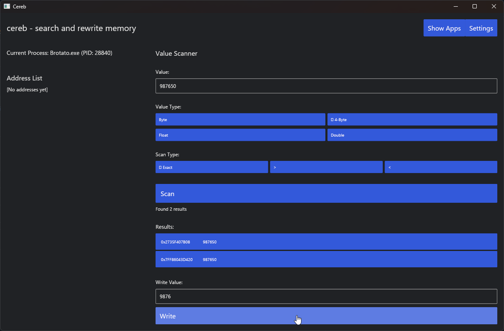

# Cereb

**Cereb** is a Rust-based application built using the **Iced** framework, designed to interact with system processes. This tool allows users to scan for specific values within the memory of running processes, modify these values at specified addresses, and facilitate real-time adjustments.

## Features

- Scan running processes
- Search for specific values in memory
- Modify values

## Screenshots



## Run
Cargo:

```bash
git clone https://github.com/Sarmirim/cereb_native.git
cd cereb_native
cargo run 2>&1
```

## Build release
 Cargo:

```bash
git clone https://github.com/Sarmirim/cereb_native.git
cd cereb_native
cargo build --release
```
